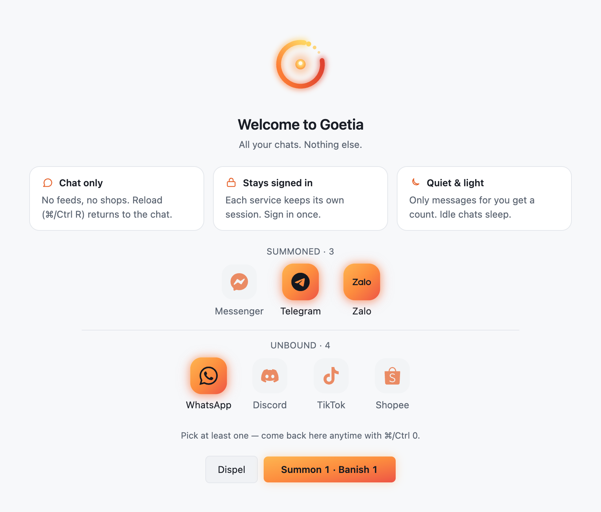
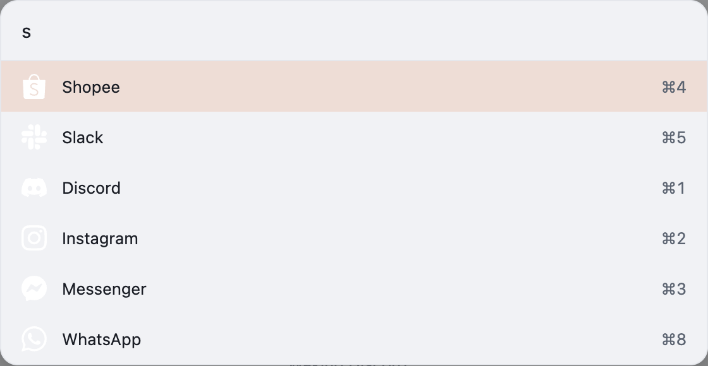
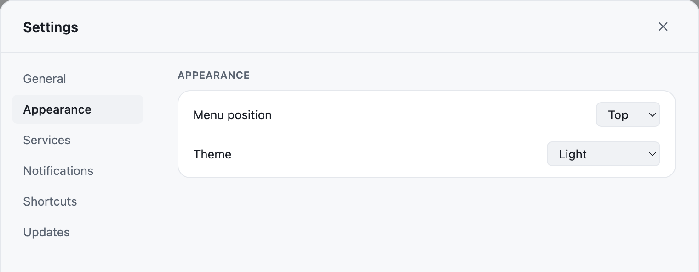
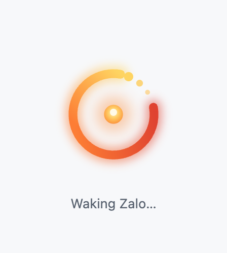
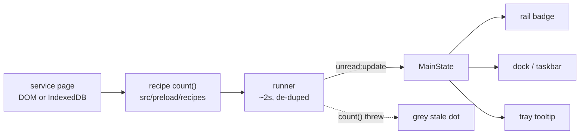

<h1 align="center">
  
</h1>

<p align="center">
  <a href="https://github.com/quyennguyenvu/goetia/releases"></a>
  
  
  
</p>

Your chat apps in one window — native notifications, unread badges, and **nothing but the chat**. No feeds, no shops, no menus. Electron + TypeScript + React, local only: no server, no account, no telemetry. macOS and Windows.

**In the circle so far:** WhatsApp, Messenger, Instagram, Telegram, Discord, Slack, Microsoft Teams, Zalo, TikTok, and Shopee. Each one is a self-contained recipe, so the roster grows without the rest noticing.

## Why Goetia

**Chat only.** Every other multi-service client embeds the whole site, feed and all. Goetia hides the host chrome, and any service that is more than chat gets pinned to its chat paths — route away from chat and the view snaps back.

**Local only.** No server, no account, no telemetry. Each service gets its own isolated `persist:<id>` session, so no two logins ever see each other.

**Badges that don't lie.** One unread recipe per service, each locked to a DOM fixture in the test suite. When a service redesigns, its tile shows a grey stale dot instead of a confident zero.

**Notifications done properly.** Native banners carrying each service's own icon, mute per service or globally, a per-service rate limit so a page can't spam you — plus synthetic notifications for the services that never fire one in-page.

**Hardened further than a hobby app usually bothers.** Electron fuses (no run-as-node, no `NODE_OPTIONS`, no CLI inspect; cookie encryption and asar integrity on), a sandboxed shell, an IPC sender policy that stops one service frame from impersonating another, origin-checked permissions, a locked-down renderer CSP, and a build-provenance attestation on every installer.

**Not just the usual suspects.** Zalo, Shopee, and TikTok sit beside WhatsApp and Slack — the services the big clients cover badly or not at all. Adding one is a recipe, a fixture, and a row in the test suite; nothing else has to move.

## A look around

Nothing loads until you pick — a fresh install starts with every service off. Home keeps the summoned apart from the unbound, and a pick only changes which side it's on once you confirm: the button spells out the change first (**Summon 1 · Banish 1** below), and **Dispel** throws the edit away. The unbound row filters by name, and dragging a summoned tile sets the rail order — a drop takes effect on its own, so reordering never rides along with an enable:

<p align="center">
  <picture>
    <source media="(prefers-color-scheme: dark)" srcset="docs/media/welcome-dark.png">
    
  </picture>
</p>

Unread counts land on the rail, on the dock or taskbar, and in the tray tooltip. Muted services keep counting quietly:

<p align="center">
  <picture>
    <source media="(prefers-color-scheme: dark)" srcset="docs/media/rail-badges-dark.png">
    
  </picture>
</p>

<kbd>Cmd</kbd>/<kbd>Ctrl</kbd>+<kbd>K</kbd> fuzzy-jumps to any service:

<p align="center">
  <picture>
    <source media="(prefers-color-scheme: dark)" srcset="docs/media/quick-switcher-dark.png">
    
  </picture>
</p>

Theme, menu position, and everything else the app lets you set:

<p align="center">
  <picture>
    <source media="(prefers-color-scheme: dark)" srcset="docs/media/settings-dark.png">
    
  </picture>
</p>

A service waking up gets Goetia's own loading screen, not a white flash:

<p align="center">
  <picture>
    <source media="(prefers-color-scheme: dark)" srcset="docs/media/waking-dark.png">
    
  </picture>
</p>

> These show Goetia's own interface only. The app is never captured signed in to anything, so no conversation appears in this repo — regenerate the whole set yourself with `pnpm media`.

## How an unread count reaches you



Counts are reported only when they change, so a hidden service costs almost nothing while it sits there.

## Install (for everyone)

Goetia is a normal desktop app — no account, no sign-up, nothing to set up. Download it, install it, open it. One heads-up first:

Goetia isn't signed with a paid Apple or Microsoft certificate (it's a personal project, not a company). So the **first** time you open it, your computer pops up a scary-looking warning. **The app is safe** — the warning only means "the developer didn't buy a certificate," not that anything is wrong. Here's how to get past it, once.

Grab the installer for your computer from the [Releases page](https://github.com/quyennguyenvu/goetia/releases).

### On a Mac

1. Download the right `.dmg` (see "Which Mac file?" just below), double-click it, and drag the **Goetia** icon onto the **Applications** folder.
2. Open **Goetia** from your Applications folder. macOS blocks this first launch with a warning — on macOS 15 and newer it reads **"Apple could not verify 'Goetia' is free of malware"**; older versions say *"damaged"* or *"cannot be opened because Apple cannot check it"*. All of them mean the same thing: nobody paid Apple for a certificate.
3. **Click "Done" — not "Move to Trash".** Move to Trash is the highlighted button, and it deletes the app.
4. Allow it once, using either method below. Goetia then opens normally from here on.

**Without Terminal (recommended).** Open **System Settings → Privacy & Security** and scroll down to the **Security** section. It now offers to open the app that was just blocked: click **Open Anyway**, confirm with Touch ID or your login password, then click **Open Anyway** again in the dialog that follows. (This button only appears *after* step 2, so don't go looking for it before then.)

**With Terminal.** Press ⌘+Space, type `Terminal`, press Return, then copy-paste this exact line and press Return:

```sh
xattr -dr com.apple.quarantine /Applications/Goetia.app
```

Now open Goetia again. (If Terminal replies "permission denied", type `sudo`, a space, then the same command again, and enter your Mac login password when asked; the password stays invisible as you type.)

> Right-click → **Open** used to be the escape hatch here. Apple removed it in macOS 15 — use one of the two methods above instead.

**Which Mac file?** Use `Goetia-<version>-arm64.dmg` for Apple Silicon (M1/M2/M3/M4 — most Macs since 2020), or `Goetia-<version>-x64.dmg` for older Intel Macs. Not sure? Apple menu (top-left) → **About This Mac**: a "Chip" that starts with "Apple" means arm64; "Intel" means x64.

### On Windows

1. Download `Goetia Setup <version>.exe` and run it.
2. Windows shows a blue box, **"Windows protected your PC."** Click **More info**, then **Run anyway**. (This shows only because the app isn't signed with a paid certificate — it's safe.)
3. It installs and opens on its own, and afterwards launches from the Start menu like any other app.

### Checking the download is genuine (optional)

Both steps above amount to telling your computer "trust this file", so it is reasonable to want proof it is the file the build server actually produced. Every release ships a `SHA256SUMS.txt`, and every installer carries a GitHub [build-provenance attestation][provenance] tying it to the exact commit and workflow run that built it:

```sh
# the file matches the published checksum
shasum -a 256 -c SHA256SUMS.txt --ignore-missing

# ...and it really came out of this repo's release workflow
gh attestation verify Goetia-<version>-arm64.dmg --repo quyennguyenvu/goetia
```

[provenance]: https://docs.github.com/actions/security-guides/using-artifact-attestations-to-establish-provenance-for-builds

### The first time you open it

You'll see every service sitting under **Choose your services**. Click the ones you want — they light up but stay put — then press **Summon** to bring them in. Now log in to each the normal way: scan the QR code (WhatsApp, Zalo) or type your username and password. **You only log in once per service**; Goetia remembers each account separately, even after you quit and reopen.

Closing the window does **not** quit Goetia — it keeps running in the menu bar (Mac) or the system tray next to the clock (Windows) so notifications still arrive. To fully quit, click that icon → **Quit**, or press ⌘Q (Mac) / Ctrl+Q (Windows).

### Handy to know

- **Service icons sit in a top bar** by default (each chat app already has its own left-hand column, so a second left rail would double up). Want them on the side? **Settings → Appearance → Menu position**.
- **Add or drop services later**: press ⌘/Ctrl+0, or click the ember sigil at the head of the icon bar, for **Home**. Summoned and unbound sit in separate rows; nothing changes until you press **Summon**/**Banish**, and **Dispel** throws a selection away. Banishing keeps the login — summon it back and you're still signed in. ⌘/Ctrl+F jumps to the box that filters the unbound row by name, and dragging a summoned tile reorders the icon bar right away — that one doesn't wait for **Summon**.
- **Shortcuts**: ⌘/Ctrl+1…9 jump to a service, ⌘/Ctrl+K opens a quick switcher, ⌘/Ctrl+0 opens Home, ⌘/Ctrl+R (or F5) reloads the current service, ⌘/Ctrl+⇧+M mutes everything, right-click an icon to mute it, and drag icons to reorder them.
- **Muting means silence, not blindness**: a muted service raises no banner and its page is silenced too, so the site's own alert sound stops as well — but its unread badge keeps counting, so you can still see what came in. Muting also silences that service's calls and voice notes while it's muted.
- **On a Mac, allow notifications the first time**: System Settings → Notifications → **Goetia** → turn on **Allow Notifications**.
- **Updates check themselves**: when a newer version is published, a small notice appears for a few seconds and a dot lands on the settings icon. Click either one to open the download page — Goetia can't install its own update, because it isn't code-signed. Turn the check off in **Settings → Updates → Automatic updates**.

### If something looks off

<details>
<summary>Known rough edges of a free, unsigned personal app</summary>

None of these mean the app is broken — they're the known rough edges of a free, unsigned personal app:

- **The "could not verify … free of malware" / "damaged" (Mac) or SmartScreen (Windows) warning** is expected; follow the install steps above. It only appears the first time.
- **Mac asks to use "confidential information stored in Goetia Safe Storage"**: click **Always Allow**. Goetia locks your saved logins with a key kept in your Mac's keychain, and because the app isn't signed with a paid certificate macOS treats each new version as a different app — so it asks again after every update. Clicking **Deny** leaves those saved logins locked and you'd have to sign in to every service again.
- **A service shows new messages in its own window but the icon has no red badge** (or shows a small grey dot): that service tweaked its website and Goetia's unread counter for it needs a small update. Chatting still works — only the badge is out of date. Tell me and I'll push a fix.
- **A service logs you out after a while**: some services do that on their own; just log back in. Your other services stay logged in.
- **Notifications from a service never appear**: open that service once and check its own notification setting is on, and (Mac) that Goetia is allowed to notify in System Settings.

</details>

## Developing

Build from source, packaging, releases, and engineering notes: [docs/DEVELOPING.md](docs/DEVELOPING.md).
