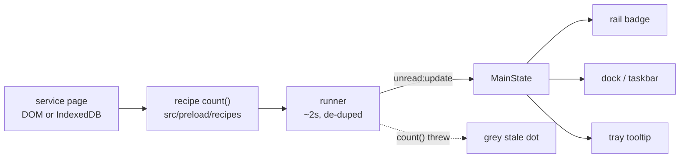

# README Showcase Implementation Plan

> **For agentic workers:** REQUIRED SUB-SKILL: Use
> superpowers:subagent-driven-development (recommended) or
> superpowers:executing-plans to implement this plan task-by-task. Steps use
> checkbox (`- [ ]`) syntax for tracking.

**Goal:** Turn `README.md` into a showcase — banner, real screenshots of
Goetia's own chrome, and six selling points — backed by a reproducible capture
script, with the developer half moved to `docs/DEVELOPING.md`.

**Architecture:** Three independent pieces. A pure capture matrix
(`scripts/lib/shots.mjs`) is the single source of truth for which PNGs exist
and what profile each needs; a Playwright-Electron driver
(`scripts/capture-media.mjs`) launches the real app against a throwaway
profile per shot and writes them; the README consumes the results. No app code
changes.

**Tech Stack:** Node ESM scripts, `@playwright/test`'s `_electron` (existing
devDependency), `@resvg/resvg-js` (existing devDependency) for SVG validation,
Vitest, markdownlint-cli2, Biome.

## Global Constraints

- Spec: `docs/superpowers/specs/2026-08-08-readme-showcase-design.md`.
- Prose wraps at 80 columns; tables and fenced code are exempt
  (`.markdownlint-cli2.jsonc`, `MD013`).
- Every committed screenshot shows **only Goetia's own chrome**. No service
  page, no third-party UI, no private data. A fresh `mkdtemp` profile per
  shot; never the author's real profile.
- `docs/media/` total size stays under 1.5 MB. Remedy if exceeded: flip
  `SCALE` in `scripts/capture-media.mjs` from `'device'` to `'css'`.
- Screenshot filenames are `<stem>-<theme>.png`, themes `light` and `dark`.
- Biome lints `scripts/**`: single quotes, 2-space indent, 100-column width.
- `vitest.config.ts` only collects `tests/unit/**/*.test.ts` — a new unit test
  must be `.ts`, and any `.mjs` it imports needs a hand-written `.d.mts` or
  `corepack pnpm typecheck` fails under `strict`.
- The README's user-facing install wording is **preserved verbatim**, because
  CLAUDE.md requires it to stay in sync with `.github/release-body.md`.
- `--goetia-e2e` injects the fake unread on **`zalo`** specifically, 1500 ms
  after startup (`src/main/index.ts:191-197`). Any shot needing a badge must
  enable `zalo`.
- **Commits:** this repo's owner commits only through
  `/grimoire-core:commit` after confirming the message. Every "Commit" step
  below means *stop and ask the user to run it* — never run `git commit`.

---

### Task 1: MD033 allowlist and the `docs/DEVELOPING.md` split

**Files:**

- Modify: `.markdownlint-cli2.jsonc`
- Create: `docs/DEVELOPING.md`
- Modify: `README.md` (remove everything from `## Build from source
  (developers)` to end of file; add a pointer)

**Interfaces:**

- Consumes: nothing.
- Produces: a lint config that permits `img`, `picture`, `source`, `p`, `div`,
  `details`, `summary`, `kbd`, `br` in Markdown — Task 5 depends on this.
  `docs/DEVELOPING.md` exists as the home for developer docs.

- [ ] **Step 1: Write the failing test — an inline-HTML probe**

The probe uses exactly the elements Task 5 needs.

```bash
cat > /tmp/md033-probe.md <<'EOF'
# Probe

<p align="center">
  <picture>
    <source media="(prefers-color-scheme: dark)" srcset="a-dark.png">
    
  </picture>
</p>

<details>
<summary>Folded</summary>

Press <kbd>Cmd</kbd>+<kbd>K</kbd>.

</details>
EOF
```

- [ ] **Step 2: Run it to make sure it fails**

Run: `npx --yes markdownlint-cli2 /tmp/md033-probe.md`

Expected: FAIL — several `MD033/no-inline-html` errors naming `p`, `picture`,
`source`, `img`, `details`, `summary`, `kbd`.

- [ ] **Step 3: Add the MD033 allowlist**

`.markdownlint-cli2.jsonc` becomes:

```jsonc
{
  // Prose wraps at 80. Fenced code is exempt: specs and plans embed real
  // source, and a Tailwind className string cannot be reflowed.
  // No "globs" on purpose — pass files explicitly, so a bare run never
  // sweeps legacy docs written before this config existed.
  "config": {
    "default": true,
    "MD013": { "line_length": 80, "code_blocks": false, "tables": false },
    // The README is a showcase: centered banner, theme-aware screenshots via
    // <picture>, folded troubleshooting. Nothing wider than this list.
    "MD033": {
      "allowed_elements": [
        "img",
        "picture",
        "source",
        "p",
        "div",
        "details",
        "summary",
        "kbd",
        "br"
      ]
    }
  }
}
```

- [ ] **Step 4: Run the probe again to verify it passes, then delete it**

Run: `npx --yes markdownlint-cli2 /tmp/md033-probe.md && rm /tmp/md033-probe.md`

Expected: `Summary: 0 issues in 0 files`.

- [ ] **Step 5: Create `docs/DEVELOPING.md`**

This is the README's current content from `## Build from source (developers)`
through the end, moved under a new H1, with the heading text de-parenthesised
and a new `pnpm media` row added to the Develop block. Write the file exactly
as the four-backtick block below encloses it — the inner three-backtick
fences are part of the content:

````markdown
# Developing Goetia

Everything needed to build, test, package, and release Goetia. User-facing
install instructions live in the [README](../README.md).

## Build from source

pnpm may not be on PATH (Node via Homebrew); run it through corepack — the
version is pinned in `package.json`'s `packageManager` field:

```sh
cd ~/workspace/gh_leo/goetia
corepack pnpm install   # first time only
corepack pnpm dev       # start with hot reload
```

Sessions persist across restarts in `~/Library/Application Support/Goetia`
(one isolated `persist:<id>` session per service).

To use plain `pnpm` instead of the `corepack pnpm` prefix, add the corepack
shims to your shell (`~/.zshrc`):

```sh
export PATH="$HOME/.local/corepack-bin:$PATH"
```

(Shims were created with `corepack enable --install-directory ~/.local/corepack-bin`.
Tools that spawn pnpm themselves — e.g. electron-builder — also need this.)

### Package the installers

```sh
corepack pnpm package:mac   # → dist/Goetia-<version>-arm64.dmg
corepack pnpm package:win   # run on a Windows machine
```

A locally built app is **not** quarantined, so it opens with no warning on
the machine that built it. The Gatekeeper prompt only affects copies that
were **downloaded** (a downloaded file carries a quarantine flag) — see the
install steps in the README for the one-time fix. To reproduce what a
downloader sees, quarantine a copy by hand:

```sh
flag="0081;$(printf %x "$(date +%s)");Safari;$(uuidgen)"
xattr -w com.apple.quarantine "$flag" /Applications/Goetia.app
spctl -a -vvv -t exec /Applications/Goetia.app   # expect: rejected
```

Every build gets a fresh ad-hoc signature, whose designated requirement is
the binary's own cdhash, so macOS sees a brand-new app identity each time.
The first launch after installing a rebuild therefore prompts for keychain
access to **Goetia Safe Storage** — the cookie-encryption key that the
`enableCookieEncryption` fuse makes Chromium store there. Click **Always
Allow**; it only covers that build. `security delete-generic-password -s
"Goetia Safe Storage"` silences the prompt but discards every saved session.
The permanent fix is a stable signing identity — see
`docs/superpowers/plans/2026-08-07-code-signing-and-notarization.md`.

Releases are cut by pushing a version tag
(`git tag v0.1.0 && git push origin v0.1.0`); the tag must match
`package.json`'s `version`.

## Develop

```sh
corepack pnpm dev          # run with HMR
corepack pnpm test         # unit tests (Vitest)
corepack pnpm e2e          # smoke test (Playwright-Electron)
corepack pnpm lint         # Biome
corepack pnpm typecheck    # tsc --noEmit
corepack pnpm media        # regenerate the README screenshots
```

`pnpm media` relaunches the app against a throwaway profile and rewrites
`docs/media/*.png`. See `scripts/capture-media.mjs`.

## Notes

- Unread counts come from small per-service "recipes" (`src/preload/recipes/`),
  adapted from [ferdium-recipes](https://github.com/ferdium/ferdium-recipes) (Apache-2.0).
  If a service redesigns and its count breaks, the tile shows a "stale" dot —
  fix the selector + fixture pair together in `tests/fixtures/`; `pnpm test`
  locks them to each other.
- Viber is intentionally absent: it has no web client to embed.
- `ERROR:base/process/process_mac.cc … task_policy_set TASK_SUPPRESSION_POLICY:
(os/kern) invalid argument (4)` on startup is harmless: Chromium failing to put
  a child process under macOS App Nap. Not ours, and nothing breaks.
- Branding: the icon is "Ember Portal" — a summoning circle as pure energy,
  matching the app's ember accent (dark `#FF9E2C`, light `#E8590C`). SVG
  sources live in `resources/` (`icon.svg`, `tray/*.svg`); regenerate PNGs
  with `rsvg-convert` (e.g. `rsvg-convert -w 1024 -h 1024 resources/icon.svg
-o resources/icon.png`).
- Design spec: `docs/superpowers/specs/2026-08-04-goetia-chat-client-design.md`.
- Implementation plan: `docs/superpowers/plans/2026-08-04-goetia-v1.md`.
- Engineering guardrails: `../CLAUDE.md`.
- Feature inventory and verification status: `FEATURES.md`.
````

- [ ] **Step 6: Cut the moved sections from `README.md`**

Delete every line from `## Build from source (developers)` to the end of the
file. In its place append:

```markdown
## Developing

Build from source, packaging, releases, and engineering notes:
[docs/DEVELOPING.md](docs/DEVELOPING.md).
```

- [ ] **Step 7: Run the lint gate to verify both files pass**

Run: `npx --yes markdownlint-cli2 README.md docs/DEVELOPING.md`

Expected: `Summary: 0 issues in 0 files`.

- [ ] **Step 8: Confirm nothing was lost in the move**

Run:

```bash
git show HEAD:README.md | sed -n '/^## Build from source/,$p' | wc -l
sed -n '/^## Build from source/,$p' docs/DEVELOPING.md | wc -l
```

Expected: the second count is within a few lines of the first (the difference
is the added `pnpm media` row, the reworded intro, and the extra Notes
bullets). If the second is dramatically smaller, content was dropped.

- [ ] **Step 9: Commit**

Stop. Ask the user to run `/grimoire-core:commit` with a message along the
lines of `docs(readme): move developer docs to docs/DEVELOPING.md`. Do not run
`git commit`.

---

### Task 2: `docs/media/banner.svg`

**Files:**

- Create: `docs/media/banner.svg`

**Interfaces:**

- Consumes: nothing.
- Produces: `docs/media/banner.svg`, a 1200×300 theme-aware banner referenced
  by Task 5.

- [ ] **Step 1: Write the failing test — render the banner headlessly**

`@resvg/resvg-js` is already a devDependency, so a valid SVG is provable
without new tooling. Save this as `/tmp/check-banner.mjs`:

```js
import { readFileSync } from 'node:fs';
import { Resvg } from '@resvg/resvg-js';

const svg = readFileSync('docs/media/banner.svg', 'utf8');
const png = new Resvg(svg, { fitTo: { mode: 'width', value: 1200 } }).render().asPng();
if (png.length < 5000) throw new Error(`banner rendered to only ${png.length} bytes`);
console.log(`ok — banner renders to ${png.length} bytes`);
```

- [ ] **Step 2: Run it to make sure it fails**

Run: `node /tmp/check-banner.mjs`

Expected: FAIL with `ENOENT ... docs/media/banner.svg`.

- [ ] **Step 3: Author the banner**

Colours are lifted from the real assets: the plate and arc gradients from
`resources/icon.svg`, and the accents from `src/renderer/src/tokens.css`
(`--accent` is `#e8590c` light, `#ff9e2c` dark). The mark is the icon's ring
and core at banner scale. Theme switching lives in a `<style>` block so one
file serves both, and the CSS custom properties give a sane light default for
renderers that ignore `prefers-color-scheme`.

Create `docs/media/banner.svg`:

```xml
<svg xmlns="http://www.w3.org/2000/svg" width="1200" height="300"
     viewBox="0 0 1200 300" role="img" aria-label="Goetia">
  <title>Goetia</title>
  <style>
    :root { --bg: #FBF7F2; --fg: #1A1F28; --dim: #6B7280; --accent: #E8590C; }
    @media (prefers-color-scheme: dark) {
      :root { --bg: #12161D; --fg: #F2F4F8; --dim: #98A2B3; --accent: #FF9E2C; }
    }
    .bg { fill: var(--bg); }
    .fg { fill: var(--fg); }
    .dim { fill: var(--dim); }
    .word { font: 700 76px system-ui, -apple-system, "Segoe UI", sans-serif;
            letter-spacing: -1.5px; }
    .tag { font: 400 25px system-ui, -apple-system, "Segoe UI", sans-serif; }
  </style>
  <defs>
    <linearGradient id="arcA" gradientUnits="userSpaceOnUse"
                    x1="77.5" y1="42.8" x2="18.7" y2="54.2">
      <stop offset="0" stop-color="#E23D28"/>
      <stop offset="1" stop-color="#FF7A1F"/>
    </linearGradient>
    <linearGradient id="arcB" gradientUnits="userSpaceOnUse"
                    x1="18.7" y1="54.2" x2="53.2" y2="18.5">
      <stop offset="0" stop-color="#FF7A1F"/>
      <stop offset="1" stop-color="#FFD34D"/>
    </linearGradient>
    <radialGradient id="core" cx="0.5" cy="0.42" r="0.75">
      <stop offset="0" stop-color="#FFF6CE"/>
      <stop offset="0.35" stop-color="#FFCE5A"/>
      <stop offset="0.7" stop-color="#FF9E2C"/>
      <stop offset="1" stop-color="#F0663A"/>
    </radialGradient>
    <filter id="softer" x="-80%" y="-80%" width="260%" height="260%">
      <feGaussianBlur stdDeviation="5.5"/>
    </filter>
  </defs>

  <rect class="bg" width="1200" height="300"/>

  <!-- Ember Portal mark, from resources/icon.svg at banner scale -->
  <g transform="translate(96,54) scale(2)">
    <path d="M77.55 42.79 A30 30 0 0 1 18.66 54.24" fill="none"
          stroke="url(#arcA)" stroke-width="6.5" stroke-linecap="round"/>
    <path d="M18.66 54.24 A30 30 0 0 1 53.21 18.45" fill="none"
          stroke="url(#arcB)" stroke-width="6.5" stroke-linecap="round"/>
    <circle cx="59.2" cy="20.2" r="3.4" fill="#FFD34D"/>
    <circle cx="67.3" cy="25" r="2.5" fill="#FFCB45" opacity="0.8"/>
    <circle cx="73.2" cy="31.7" r="1.8" fill="#FFC13D" opacity="0.55"/>
    <circle cx="48" cy="48" r="13" fill="#FF8A2A" opacity="0.45"
            filter="url(#softer)"/>
    <circle cx="48" cy="48" r="7" fill="url(#core)"/>
    <circle cx="48" cy="46.5" r="2.6" fill="#FFFBEA" opacity="0.95"/>
  </g>

  <text class="fg word" x="320" y="146">Goetia</text>
  <text class="dim tag" x="324" y="192">Seven chat services, one window,</text>
  <text class="dim tag" x="324" y="226">nothing but the chat.</text>
  <rect x="324" y="248" width="132" height="5" rx="2.5" fill="var(--accent)"/>
</svg>
```

- [ ] **Step 4: Run the check again to verify it passes**

Run: `node /tmp/check-banner.mjs && rm /tmp/check-banner.mjs`

Expected: `ok — banner renders to <N> bytes` with N ≥ 5000.

- [ ] **Step 5: Eyeball it in both themes**

Open `docs/media/banner.svg` in a browser and toggle the OS appearance
between light and dark. Expected: background and wordmark invert; the ember
ring and core stay warm in both; no clipped text.

- [ ] **Step 6: Commit**

Stop. Ask the user to run `/grimoire-core:commit`, suggested message
`docs(readme): add showcase banner`.

---

### Task 3: the pure capture matrix

**Files:**

- Create: `scripts/lib/shots.mjs`
- Create: `scripts/lib/shots.d.mts`
- Test: `tests/unit/capture-shots.test.ts`

**Interfaces:**

- Consumes: `SERVICES` from `src/shared/services.ts` (test only).
- Produces, all imported by Task 4:
  - `ALL_SERVICE_IDS: ServiceId[]`
  - `THEMES: Theme[]` — `['light', 'dark']`
  - `SHOTS: Shot[]` — one entry per committed PNG, where
    `Shot = { stem: string; surface: Surface; enabled: ServiceId[];
    muted?: ServiceId[]; theme: Theme }` and
    `Surface = 'welcome' | 'rail' | 'switcher' | 'settings' | 'waking'`
  - `settingsFor(shot: Shot)` → the object written to the throwaway
    profile's `settings.json`:
    `{ theme, railPosition: 'top', disabled: Record<ServiceId, boolean>,
    muted: Record<ServiceId, boolean> }`

- [ ] **Step 1: Write the failing test**

Create `tests/unit/capture-shots.test.ts`:

```ts
import { describe, expect, it } from 'vitest';
import { ALL_SERVICE_IDS, SHOTS, THEMES, settingsFor } from '../../scripts/lib/shots.mjs';
import { SERVICES } from '../../src/shared/services';

describe('capture matrix', () => {
  it('pairs every surface with every theme, with unique filenames', () => {
    const stems = [...new Set(SHOTS.map((s) => s.stem))];
    expect(SHOTS).toHaveLength(stems.length * THEMES.length);
    for (const theme of THEMES) {
      const forTheme = SHOTS.filter((s) => s.theme === theme).map((s) => s.stem);
      expect([...forTheme].sort()).toEqual([...stems].sort());
    }
    const files = SHOTS.map((s) => `${s.stem}-${s.theme}.png`);
    expect(new Set(files).size).toBe(files.length);
  });

  it('stays in sync with the app service catalog', () => {
    expect([...ALL_SERVICE_IDS].sort()).toEqual(SERVICES.map((s) => s.id).sort());
  });

  it('disables exactly the services a shot does not enable', () => {
    const shot = SHOTS.find((s) => s.stem === 'rail-badges' && s.theme === 'dark');
    if (!shot) throw new Error('rail-badges/dark missing from the matrix');
    const seeded = settingsFor(shot);
    expect(seeded.theme).toBe('dark');
    expect(seeded.railPosition).toBe('top');
    // rail-badges enables zalo, telegram, whatsapp and mutes whatsapp
    expect(seeded.disabled.zalo).toBe(false);
    expect(seeded.disabled.whatsapp).toBe(false);
    expect(seeded.disabled.discord).toBe(true);
    expect(seeded.muted.whatsapp).toBe(true);
    expect(seeded.muted.zalo).toBe(false);
    expect(Object.keys(seeded.disabled).sort()).toEqual([...ALL_SERVICE_IDS].sort());
    expect(Object.keys(seeded.muted).sort()).toEqual([...ALL_SERVICE_IDS].sort());
  });

  it('leaves every service disabled for the welcome shot', () => {
    const shot = SHOTS.find((s) => s.stem === 'welcome');
    if (!shot) throw new Error('welcome missing from the matrix');
    expect(Object.values(settingsFor(shot).disabled).every(Boolean)).toBe(true);
  });

  it('enables zalo for any shot that needs the injected unread badge', () => {
    // --goetia-e2e fires the fake count on zalo only (src/main/index.ts)
    const badgeShots = SHOTS.filter((s) => s.surface === 'rail');
    expect(badgeShots.length).toBeGreaterThan(0);
    for (const s of badgeShots) expect(s.enabled).toContain('zalo');
  });
});
```

- [ ] **Step 2: Run it to make sure it fails**

Run: `corepack pnpm vitest run tests/unit/capture-shots.test.ts`

Expected: FAIL — cannot resolve `../../scripts/lib/shots.mjs`.

- [ ] **Step 3: Write the matrix**

Create `scripts/lib/shots.mjs`:

```js
/**
 * The capture matrix: one entry per PNG committed to docs/media.
 * Pure data — the interaction for each `surface` lives in capture-media.mjs.
 */

/** Must match SERVICES in src/shared/services.ts (locked by a unit test). */
export const ALL_SERVICE_IDS = [
  'messenger',
  'telegram',
  'zalo',
  'whatsapp',
  'discord',
  'tiktok',
  'shopee',
];

export const THEMES = ['light', 'dark'];

// zalo is enabled wherever a badge is needed: --goetia-e2e injects the fake
// unread count on zalo alone.
const SURFACES = [
  { stem: 'welcome', surface: 'welcome', enabled: [] },
  {
    stem: 'rail-badges',
    surface: 'rail',
    enabled: ['zalo', 'telegram', 'whatsapp'],
    muted: ['whatsapp'],
  },
  { stem: 'quick-switcher', surface: 'switcher', enabled: ['zalo', 'telegram', 'whatsapp'] },
  { stem: 'settings', surface: 'settings', enabled: ['zalo', 'telegram'] },
  { stem: 'waking', surface: 'waking', enabled: ['zalo'] },
];

export const SHOTS = THEMES.flatMap((theme) => SURFACES.map((s) => ({ ...s, theme })));

/** The settings.json seeded into a shot's throwaway profile. */
export function settingsFor(shot) {
  const flags = (ids) => Object.fromEntries(ALL_SERVICE_IDS.map((id) => [id, ids.includes(id)]));
  return {
    theme: shot.theme,
    railPosition: 'top',
    disabled: flags(ALL_SERVICE_IDS.filter((id) => !shot.enabled.includes(id))),
    muted: flags(shot.muted ?? []),
  };
}
```

- [ ] **Step 4: Write the type declarations**

`tsconfig.json` does not include `scripts/`, but the test does import from it,
and `strict` mode rejects an untyped `.mjs`. TypeScript resolves `./x.mjs` to
`./x.d.mts`. Create `scripts/lib/shots.d.mts`:

```ts
export type ServiceId =
  | 'messenger'
  | 'telegram'
  | 'zalo'
  | 'whatsapp'
  | 'discord'
  | 'tiktok'
  | 'shopee';

export type Theme = 'light' | 'dark';
export type Surface = 'welcome' | 'rail' | 'switcher' | 'settings' | 'waking';

export interface Shot {
  stem: string;
  surface: Surface;
  enabled: ServiceId[];
  muted?: ServiceId[];
  theme: Theme;
}

export interface SeededSettings {
  theme: Theme;
  railPosition: 'top';
  disabled: Record<ServiceId, boolean>;
  muted: Record<ServiceId, boolean>;
}

export const ALL_SERVICE_IDS: ServiceId[];
export const THEMES: Theme[];
export const SHOTS: Shot[];
export function settingsFor(shot: Shot): SeededSettings;
```

- [ ] **Step 5: Run the test to verify it passes**

Run: `corepack pnpm vitest run tests/unit/capture-shots.test.ts`

Expected: PASS, 5 tests.

- [ ] **Step 6: Run the full gate**

Run: `corepack pnpm test && corepack pnpm typecheck && corepack pnpm lint`

Expected: all green. `typecheck` is the real risk here — if it reports
`shots.mjs` implicitly has type `any`, the `.d.mts` filename or its exported
names do not match Step 3.

- [ ] **Step 7: Commit**

Stop. Ask the user to run `/grimoire-core:commit`, suggested message
`test(media): add capture matrix for README screenshots`.

---

### Task 4: the capture driver

**Files:**

- Create: `scripts/capture-media.mjs`
- Modify: `package.json` (add the `media` script)
- Creates as output: `docs/media/*.png` (10 files)

**Interfaces:**

- Consumes: `SHOTS`, `settingsFor` from `scripts/lib/shots.mjs` (Task 3).
- Produces: `docs/media/{welcome,rail-badges,quick-switcher,settings,waking}-{light,dark}.png`,
  which Task 5 references.

- [ ] **Step 1: Add the `media` script**

In `package.json`, inside `"scripts"`, after the `"lint"` entry:

```json
    "media": "electron-vite build && node scripts/capture-media.mjs",
```

- [ ] **Step 2: Run it to make sure it fails**

Run: `corepack pnpm media`

Expected: the build succeeds, then FAIL with
`Cannot find module .../scripts/capture-media.mjs`.

- [ ] **Step 3: Write the driver**

Every locator below already exists in the shipped components: `welcome`
(`Welcome.tsx`), `rail` and `settings-btn` (`Rail.tsx`), `switcher`
(`QuickSwitcher.tsx`), `settings` (`SettingsView.tsx`). The shell page is the
`file://` page that is not `loading.html`, matching the e2e specs.

Create `scripts/capture-media.mjs`:

```js
/**
 * Regenerates the README screenshots in docs/media.
 *
 * Each shot launches the real app against a fresh throwaway profile, so no
 * account is ever signed in and nothing private can be in frame. Only the
 * shell renderer and the loading overlay are captured — service views are
 * separate webContents, so a third-party page cannot leak into a shot.
 *
 * Deliberately not a tests/e2e spec: CI runs that directory, and CI must not
 * repaint committed assets.
 */
import { mkdirSync, mkdtempSync, writeFileSync } from 'node:fs';
import { tmpdir } from 'node:os';
import { join } from 'node:path';
import { _electron as electron } from '@playwright/test';
import { SHOTS, settingsFor } from './lib/shots.mjs';

const OUT = 'docs/media';

// 'device' keeps Retina crispness. Flip to 'css' if docs/media outgrows its
// 1.5 MB budget — it halves the pixel dimensions on a HiDPI display.
const SCALE = 'device';

const isShell = (p) => p.url().startsWith('file://') && !p.url().includes('loading.html');
const isOverlay = (p) => p.url().includes('loading.html');

/** Interaction per surface; returns the Playwright target to screenshot. */
const SURFACES = {
  async welcome({ win }) {
    const welcome = win.locator('[data-testid="welcome"]');
    await welcome.waitFor();
    return welcome;
  },

  async rail({ win }) {
    const rail = win.locator('[data-testid="rail"]');
    await rail.waitFor();
    // --goetia-e2e injects unread 3 on zalo about 1.5s after startup
    await rail.getByText('3', { exact: true }).waitFor({ timeout: 20_000 });
    return rail;
  },

  async switcher({ win }) {
    await win.locator('[data-testid="rail"]').waitFor();
    // same channel the ⌘K accelerator sends; menu accelerators do not reach
    // the page from Playwright's keyboard
    await win.evaluate(() => window.goetia.send('switcher:setOpen', { open: true }));
    const switcher = win.locator('[data-testid="switcher"]');
    await switcher.waitFor();
    await switcher.locator('input').fill('te');
    await win.waitForTimeout(150);
    return switcher;
  },

  async settings({ win }) {
    await win.locator('[data-testid="settings-btn"]').click();
    const panel = win.locator('[data-testid="settings"]');
    await panel.waitFor();
    await win.waitForTimeout(250);
    return panel;
  },

  async waking({ app }) {
    const overlay =
      app.windows().find(isOverlay) ??
      (await app.waitForEvent('window', { predicate: isOverlay, timeout: 15_000 }));
    await overlay.waitForLoadState('domcontentloaded');
    // the ring spins and embers drift: settle on a representative frame
    await overlay.waitForTimeout(1200);
    return overlay;
  },
};

async function capture(shot) {
  const profile = mkdtempSync(join(tmpdir(), 'goetia-media-'));
  writeFileSync(join(profile, 'settings.json'), JSON.stringify(settingsFor(shot), null, 2));

  const app = await electron.launch({
    args: ['out/main/index.js', '--goetia-e2e', `--goetia-user-data=${profile}`],
  });
  const win =
    app.windows().find(isShell) ?? (await app.waitForEvent('window', { predicate: isShell }));

  // the renderer stamps the effective theme on <html>; wait for it so a shot
  // can never be captured mid-swap
  await win.waitForFunction(
    (theme) => document.documentElement.dataset.theme === theme,
    shot.theme,
  );

  const file = join(OUT, `${shot.stem}-${shot.theme}.png`);
  try {
    const target = await SURFACES[shot.surface]({ app, win });
    await target.screenshot({ path: file, scale: SCALE });
    console.log(`✓ ${file}`);
  } finally {
    await app.close();
  }
}

mkdirSync(OUT, { recursive: true });
for (const shot of SHOTS) {
  await capture(shot);
}
console.log(`\n${SHOTS.length} shots written to ${OUT}/`);
```

- [ ] **Step 4: Run it to verify all ten shots are produced**

Run: `corepack pnpm media`

Expected: ten `✓ docs/media/...png` lines, then
`10 shots written to docs/media/`.

If the `waking` shot times out because a logged-out page finished loading
before the overlay could be captured, delete the `waking` entry from
`SURFACES` in `scripts/lib/shots.mjs` and its handler in
`scripts/capture-media.mjs`. The matrix test derives its expected count, so
it keeps passing at eight shots. The spec authorises dropping this pair first.

- [ ] **Step 5: Verify the files, the budget, and the privacy rule**

Run:

```bash
ls -la docs/media/*.png | wc -l
du -sh docs/media
```

Expected: 10 files; `docs/media` under 1.5 MB. If over, set `SCALE = 'css'`
and re-run `corepack pnpm media`.

Then open all ten PNGs and confirm by eye: no service page content, no chat
list, no contact name, no avatar — Goetia's own chrome only. Any shot that
fails this is a spec violation, not a cosmetic problem.

- [ ] **Step 6: Verify determinism on the static pairs**

Run:

```bash
shasum -a 256 docs/media/settings-dark.png docs/media/welcome-dark.png > /tmp/before.txt
corepack pnpm media >/dev/null
shasum -a 256 docs/media/settings-dark.png docs/media/welcome-dark.png | diff - /tmp/before.txt
```

Expected: no diff, for all ten files. The script emulates reduced motion on
every page before capturing, which parks the ember portal animation, so even
the welcome, rail, and overlay shots are byte-stable.

Implementation note from the executed run: the badge shot originally raced
`--goetia-e2e`. `DEFAULT_SETTINGS.neverHibernate` is `true` for every service,
so each enabled service loads a hidden view at startup, and zalo's runner
reported `{0,0}` for the logged-out page within ~500 ms — overwriting the
injected count before the screenshot. Seeding `neverHibernate: false` in
`settingsFor` means zalo has no view and no runner, so the injected badge
persists indefinitely. Do not "fix" this by adding waits.

- [ ] **Step 7: Confirm the shared e2e harness is undisturbed**

Run: `env -u ELECTRON_RUN_AS_NODE corepack pnpm e2e`

Expected: all specs pass. (VS Code shells export `ELECTRON_RUN_AS_NODE`,
which breaks Playwright's Electron launcher — hence `env -u`.)

- [ ] **Step 8: Run the full gate**

Run: `corepack pnpm lint && corepack pnpm typecheck && corepack pnpm test`

Expected: all green.

- [ ] **Step 9: Commit**

Stop. Ask the user to run `/grimoire-core:commit`, suggested message
`docs(readme): add screenshot capture script and captures`.

---

### Task 5: the showcase README

**Files:**

- Modify: `README.md` (replace everything above `## Install (for everyone)`;
  wrap `### If something looks off` in `<details>`; leave install wording
  untouched)

**Interfaces:**

- Consumes: `docs/media/banner.svg` (Task 2), `docs/media/*.png` (Task 4), the
  MD033 allowlist (Task 1), `docs/DEVELOPING.md` (Task 1).
- Produces: the final README. Nothing depends on it.

- [ ] **Step 1: Write the failing test — every referenced image must exist**

Save as `/tmp/check-images.mjs`:

```js
import { existsSync, readFileSync } from 'node:fs';

const md = readFileSync('README.md', 'utf8');
const refs = [...md.matchAll(/(?:src|srcset)="(docs\/media\/[^"]+)"/g)].map((m) => m[1]);
if (refs.length < 11) throw new Error(`expected 11+ image refs, found ${refs.length}`);
const missing = refs.filter((p) => !existsSync(p));
if (missing.length) throw new Error(`missing: ${missing.join(', ')}`);
console.log(`ok — ${refs.length} image references, all present`);
```

- [ ] **Step 2: Run it to make sure it fails**

Run: `node /tmp/check-images.mjs`

Expected: FAIL — `expected 11+ image refs, found 0` (the README has no images
yet).

- [ ] **Step 3: Replace everything above `## Install (for everyone)`**

Delete the current lines 1–9 (the `# Goetia` heading through the "Built with
Electron…" paragraph) and put this in their place. The shields use the repo
`quyennguyenvu/goetia` and Electron 43, matching `package.json`. The inner
three-backtick `mermaid` fence is part of the content:

````markdown
<p align="center">
  
</p>

<p align="center">
  <a href="https://github.com/quyennguyenvu/goetia/releases"></a>
  
  
  
</p>

WhatsApp, Messenger, Telegram, Discord, Zalo, TikTok, and Shopee in one
window — with native notifications and unread badges, and **nothing but the
chat**. No feeds, no shops, no menus. Electron + TypeScript + React, local
only: no server, no account, no telemetry.

## Why Goetia

**Chat only.** Every other multi-service client embeds the whole site, feed
and all. Goetia hides the host chrome and pins Facebook and TikTok to their
chat paths — route away from chat and the view snaps back.

**Local only.** No server, no account, no telemetry. Each service gets its
own isolated `persist:<id>` session, so seven logins never see each other.

**Badges that don't lie.** One unread recipe per service, each locked to a
DOM fixture in the test suite. When a service redesigns, its tile shows a
grey stale dot instead of a confident zero.

**Notifications done properly.** Native banners carrying each service's own
icon, mute per service or globally, a per-service rate limit so a page can't
spam you — plus synthetic notifications for Messenger, which never fires one
in-page.

**Hardened further than a hobby app usually bothers.** Electron fuses (no
run-as-node, no `NODE_OPTIONS`, no CLI inspect; cookie encryption and asar
integrity on), a sandboxed shell, an IPC sender policy that stops one service
frame from impersonating another, origin-checked permissions, a locked-down
renderer CSP, and a build-provenance attestation on every installer.

**Zalo, Shopee, and TikTok included.** The services the big clients cover
badly or not at all.

## A look around

The seven services, on a fresh install — nothing loads until you pick:

<p align="center">
  <picture>
    <source media="(prefers-color-scheme: dark)" srcset="docs/media/welcome-dark.png">
    
  </picture>
</p>

Unread counts land on the rail, on the dock or taskbar, and in the tray
tooltip. Muted services keep counting quietly:

<p align="center">
  <picture>
    <source media="(prefers-color-scheme: dark)" srcset="docs/media/rail-badges-dark.png">
    
  </picture>
</p>

<kbd>Cmd</kbd>/<kbd>Ctrl</kbd>+<kbd>K</kbd> fuzzy-jumps to any service:

<p align="center">
  <picture>
    <source media="(prefers-color-scheme: dark)" srcset="docs/media/quick-switcher-dark.png">
    
  </picture>
</p>

Rail position, theme, close-to-tray, launch-at-login, and update checks:

<p align="center">
  <picture>
    <source media="(prefers-color-scheme: dark)" srcset="docs/media/settings-dark.png">
    
  </picture>
</p>

A service waking up gets Goetia's own loading screen rather than a white
flash:

<p align="center">
  <picture>
    <source media="(prefers-color-scheme: dark)" srcset="docs/media/waking-dark.png">
    
  </picture>
</p>

> Screenshots show Goetia's own interface only — the app is never captured
> signed in to anything, so no conversation appears in this repo. Regenerate
> them yourself with `pnpm media`.

## How an unread count reaches you



Counts are reported only when they change, so a hidden service costs almost
nothing while it sits there.
````

- [ ] **Step 4: Fold the troubleshooting section**

Leave the `### If something looks off` heading and every bullet under it
exactly as written. Immediately after the heading, insert:

```markdown
<details>
<summary>Known rough edges of a free, unsigned personal app</summary>
```

and immediately before `## Developing`, insert:

```markdown
</details>
```

Both inserted blocks need a blank line before and after them, or MD031/MD032
will fire.

- [ ] **Step 5: Run the image check to verify it passes**

Run: `node /tmp/check-images.mjs && rm /tmp/check-images.mjs`

Expected: `ok — 11 image references, all present`.

- [ ] **Step 6: Run the lint gate**

Run: `npx --yes markdownlint-cli2 README.md docs/DEVELOPING.md`

Expected: `Summary: 0 issues in 0 files`. If MD033 fires, the element is
outside Task 1's allowlist — use an allowed element rather than widening the
list.

- [ ] **Step 7: Verify the install wording is byte-identical**

The README ↔ `.github/release-body.md` sync CLAUDE.md requires must not have
drifted:

```bash
git show HEAD:README.md | sed -n '/^## Install (for everyone)/,/^### If something looks off/p' \
  > /tmp/install-before.txt
sed -n '/^## Install (for everyone)/,/^### If something looks off/p' README.md \
  | diff - /tmp/install-before.txt && echo "install section unchanged"
```

Expected: `install section unchanged`.

- [ ] **Step 8: Verify the rendered page**

Push the branch and open the README on GitHub, or use a Markdown preview that
renders mermaid. Check: banner centred and theme-appropriate; all four
shields resolve; five screenshots render and follow the theme; the mermaid
diagram draws; the `<details>` block folds and opens; the
`docs/DEVELOPING.md` link resolves. Then switch your GitHub appearance
setting to the other theme and confirm the images swap.

- [ ] **Step 9: Run the whole definition of done**

Run:

```bash
corepack pnpm lint && corepack pnpm typecheck && corepack pnpm test
env -u ELECTRON_RUN_AS_NODE corepack pnpm e2e
```

Expected: all green.

- [ ] **Step 10: Commit**

Stop. Ask the user to run `/grimoire-core:commit`, suggested message
`docs(readme): restructure as a showcase`.

---

## Self-review

**Spec coverage.** Every spec section maps to a task: MD033 allowlist and the
`DEVELOPING.md` move → Task 1; `banner.svg` → Task 2; the capture matrix and
its five surfaces → Task 3; `scripts/capture-media.mjs` plus the `media`
script → Task 4; README structure, the six selling points, the mermaid
diagram, and the `<details>` fold → Task 5. The spec's verification list is
distributed across Task 4 Steps 5–8 and Task 5 Steps 5–9. The "chrome only"
decision is enforced by Task 4 Step 5 and stated in the README's own
disclaimer.

**Type consistency.** `settingsFor`, `SHOTS`, `THEMES`, `ALL_SERVICE_IDS`,
`Shot`, `Surface`, and `SeededSettings` are spelled identically in Task 3's
test, implementation, and declarations, and in Task 4's import. Surface keys
in `SURFACES` (`welcome`, `rail`, `switcher`, `settings`, `waking`) match the
`surface` values in `shots.mjs` and the `Surface` union.

**Known risks, each with a documented remedy in-step.**

1. `waking` may race the overlay's teardown — Task 4 Step 4 says to drop the
   pair, which the derived test count tolerates.
2. `docs/media` may exceed 1.5 MB — Task 4 Step 5 flips one constant.
3. `tsc` may reject the `.mjs` import — Task 3 Step 6 names the `.d.mts` as
   the cause.

## Out of scope

Any screenshot of real conversations; animated GIFs or recordings;
restructuring `docs/FEATURES.md`; wiring the navigation guard or code
signing.
